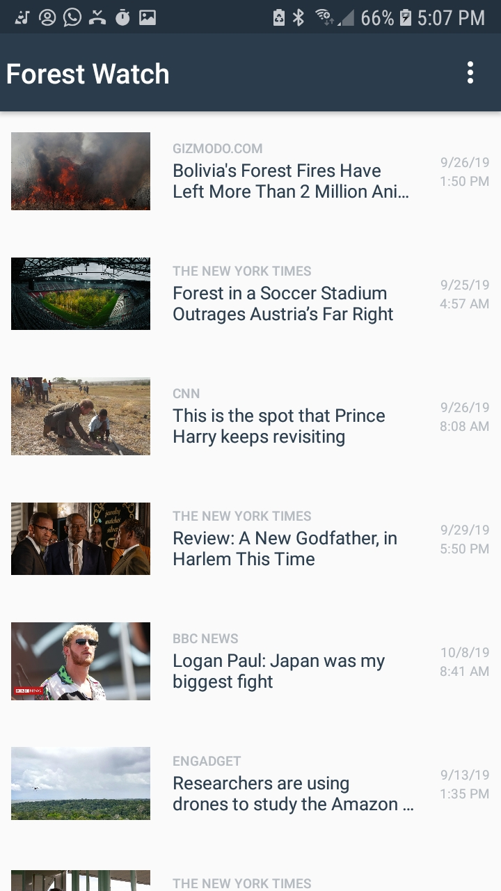
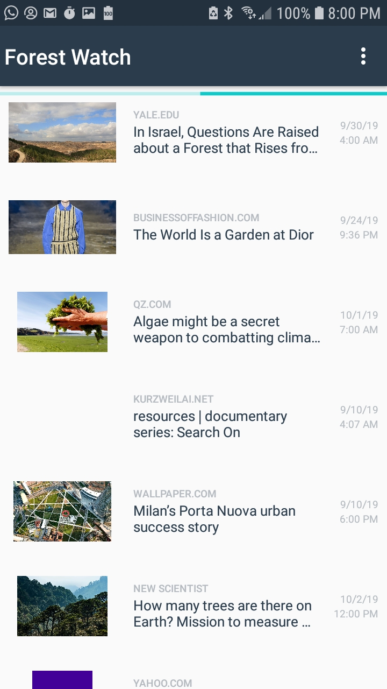
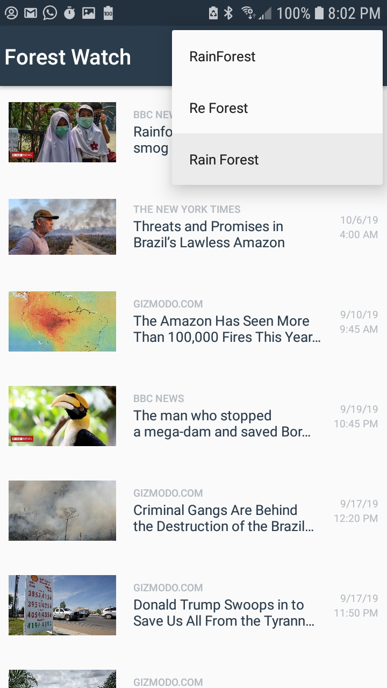

# RainForest-News

**Introduction**
> Find news about the earth and its climate

>New and Improved version can be found here: https://github.com/jmreyesortiz/GreenNewsApp

**Libraries / Tools**

* AsyncTaskLoader 
* HttpURLConnection
* Picasso
* GSON

**App Architecture**

MVC Architecture using AsynTaskLoader for JSON parsing.

**Features**
- Search news about various important topics about the earth.
- Obtain these news from the NewsApi
- Browse the news with your favorite browser

**Screenshots**

**Installation**
1. Clone or Download the Repo
2. Go to newsapi.org, sign up and obtain an APIKEY
3. Go to `app/src/main/java/com.juanma.greennews/QueryUtils.Java` and change the variable ` private static final String API_KEY ="Your_API_Key"; ; ` to your obtained api key. Then go to 
4. After this, you'll be able to run the app.
